<!-- Header -->

  

  I build full-stack web applications with an emphasis on clean architecture and thoughtful user experience. 
  Currently exploring agentic AI systems and real-time data pipelines. 
  When I'm not at the keyboard, I'm probably working on a track.

  <a href="https://avin27.github.io/portfolio-v1">Portfolio</a> &nbsp;·&nbsp;
  <a href="https://linkedin.com/in/avinash-s-naidu-0950351bb">LinkedIn</a> &nbsp;·&nbsp;
  <a href="mailto:avinashnaidu1227@gmail.com">Email</a>

---

## Languages

## Frontend

## Backend & Infrastructure

## Generative AI

---

## GitHub Stats

  
  &nbsp;
  

  

---

<!-- Footer -->

  

